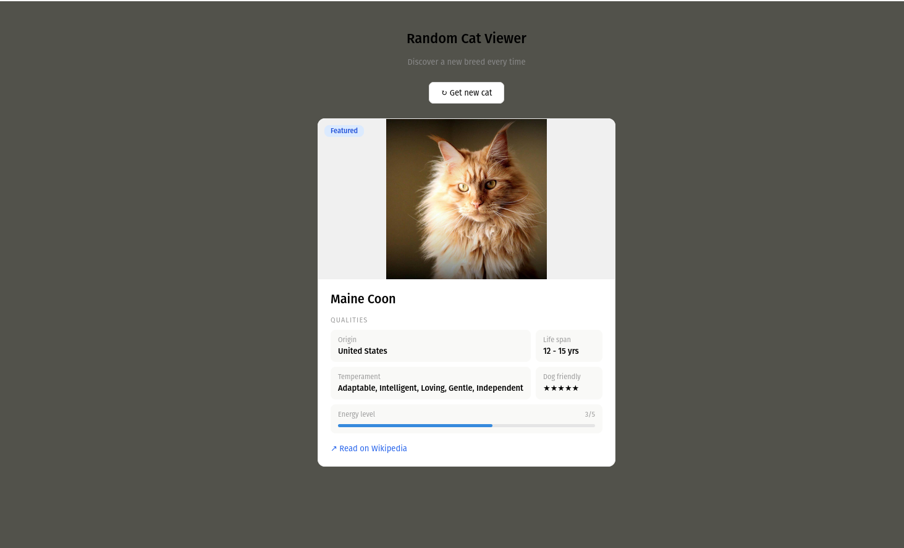

# 🐱 Random Cat Viewer

A React-based app that fetches and displays a random cat breed on every click — built to practice component architecture, state management, and hooks.

## 🚀 Features

- Fetches a random cat breed from [FreeAPI](https://freeapi.app/) on load and on demand
- Displays breed image, origin, lifespan, temperament, and dog-friendliness
- Animated energy level progress bar
- Wikipedia link per breed
- Loading state between fetches

## 🛠️ Tech Stack

- **React.js** — `useState`, `useEffect`
- **Vanilla CSS-in-JS** — inline styles with a centralized `styles` object
- **FreeAPI** — public cats data API

## 📦 Getting Started

```bash
# Clone the repository
git clone https://github.com/Saimahmed78/Random-Cat-Viewer.git

# Navigate into the project
cd Random-Cat-Viewer

# Install dependencies
npm install

# Start the development server
npm run dev
```

## 🔌 API

Data is fetched from:

```
GET https://api.freeapi.app/api/v1/public/cats/cat/random
```

No API key required.

## 📁 Project Structure

```
src/
├── App.jsx        # Main component — fetches data, renders card
├── main.jsx       # React entry point
└── assets/        # Static assets
```

## 🧠 Concepts Practiced

- `useEffect` for fetching data on initial mount
- `useState` for managing loading and data states
- `finally` block to guarantee loading state resets on success or failure
- Conditional rendering based on loading state
- Dynamic star ratings and animated progress bars


## 🖼️ Preview

> Clean card UI displaying a random cat breed with stats, energy bar, and a Wikipedia link.


## 👤 Author

**Saim Ahmed**  
BS Software Engineering — Riphah International University, Faisalabad

<br/>

[](https://github.com/Saimahmed78)
[](https://www.linkedin.com/in/saim-ahmed-722b802ba/)